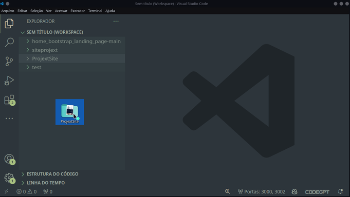
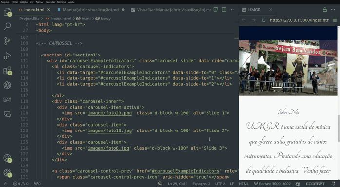
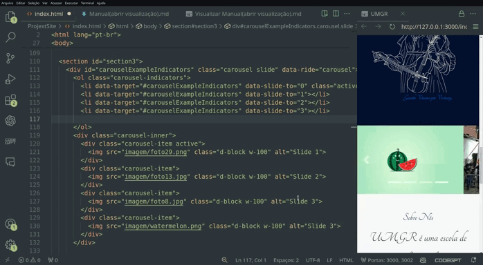

# 📙Tutorial
## _Guia de procedimentos usuais ao administrador_

## Processos

- Instalação
- Editar Texto
- Trocar Imagem
- Add e Remover Quantidade de Imagens
- Trocar Vídeo
- Aplicação das atualizações

## Instalação
Para a manipulação dos códigos é necessário o uso de uma IDE, orientamos o VScode, que pode ser baixado pelo site https://code.visualstudio.com. 
Após a instalação, basta arrastar a pasta do projeto para o workspace do Vscode e escolher a opção adicionar.




***Clicar no arquivo index.html***

 
## Editar Texto
Para editar qualquer um dos tópicos mensionados basta apenas trocar o conteúdo que se encontra dentro das tags html, nos casos dos textos, esses ficam entre os sinais `<p>Apenas</p>` `<h1>o conteúdo</h1>` `<h2>que se encontra</h2>` `<h3>dentro</h3>`, `<h4>dessas tags</h4>`. Ex:
```html
trocar texto
<p>texto original</p>
<p>texto editado</p>
```


> Dica: A princípio, os textos editáveis se encontram nas linhas: 83, 150, 155.<br> Ao clicar com o botão direito do mouse na tela e escolher a opção "Mostrar Versão Prévia" será aberta uma janela de preview.<br>
> Obs: Se as linhas aumentarem devido a editação, os números das linhas não corresponderão mais exatamente. O correto é se orientar entre as sections e as respectívas tags a serem editadas, demonstrado nos gifs.<br> 
> Importante: Salvar o arquivo após as modificações.

## Trocar Imagem
Para trocar uma imagem é necessário copiá-la para dentro da pasta Imagem e no código na tag ``trocar apenas o nome do arquivo e sua extensão(jpg,jpeg,png) caso necessário. Ex:

```html
trocar imagem


Imagem trocada

```


> Nota: As imagens editáveis do Carrossel se encontram nas linhas: 120, 123, 126.
<br> 
> Obs: As imagens precisam ter uma dimensão aproximada entre elas, ex atual: 960x540px.


## Add e Remover Quantidade de Imagem

Diferentemente de trocar uma imagem em uma tag já criada, adicionar e remover permite que se possa aumentar ou diminuir a quantidade de imagens no carrossel. A princípio, são 3 imagens no carrossel; agora passará a ter 4, ou poderá voltar a ter 3. Será preciso realizar dos procedimentos:

1° Passo - Na section Carrossel, copiar toda a tag `<li></li>` da até então linha(115) e colar abaixo da linha da qual a mesma foi copiada, incrementando a nova tag com +1.   

```html 
Código Original

<!-- Carrossel -->

<li data-target="#carouselExampleIndicators" data-slide-to="2"></li><!-- Apenas essa linha do código a ser copiada-->

Código acrescentando uma nova imagem
...
<li data-target="#carouselExampleIndicators" data-slide-to="2"></li>
<li data-target="#carouselExampleIndicators" data-slide-to="3"></li><!-- Novo código adicionado e incrementado -->
```

2° Passo - Na mesma section Carrossel, copiar TODA tag `<div></div>` da até então linha(125 à 127) e colar abaixo da linha da qual a mesma foi copiada, incrementando a nova tag no Slide com +1 e acrescentar o nome da nova imagem.

```html 
Código Original

<!-- Carrossel -->

<div class="carousel-item">
    
</div><!-- Todo esse código a ser copiado-->

Código acrescentando uma nova imagem
...
<div class="carousel-item">
    
</div>
<div class="carousel-item">
    
</div><!-- Novo código adicionado e incrementado -->
```



> Nota: Por convenção, em muitas linguagens de programação os índices começam pelo zero, como no código `<li data-target="#carouselExampleIndicators" data-slide-to="0" class="active"></li>`. <br>
> Para excluir uma imagem, faça o processo inverso.
 




## Trocar Vídeo
Para trocar o vídeo, na section Modal, basta acessar o vídeo que se pretende usar pelo youtube, clicar em share/compartilhar, na janela que abrir selecione <>Embed e copie todo o código fornecido. Vá na até então linha(205) e troque toda a tag `<iframe></iframe>`.

```html 
Vídeo Atual
<div class="video-responsive">
     <iframe src="https://www.youtube.com/embed/ixxWULtLa-U?si=q7ey99zRUto9XMf2" title="YouTube video player" frameborder="0" allow="accelerometer; autoplay; clipboard-write; encrypted-media; gyroscope; picture-in-picture; web-share" referrerpolicy="strict-origin-when-cross-origin" allowfullscreen></iframe>
</div>

Vídeo Novo
<div class="video-responsive">
    <iframe width="560" height="315" src="https://www.youtube.com/embed/mMYmzlK7Kno?si=ZP5dRv1d5x0izO6g" title="YouTube video player" frameborder="0" allow="accelerometer; autoplay; clipboard-write; encrypted-media; gyroscope; picture-in-picture; web-share" referrerpolicy="strict-origin-when-cross-origin" allowfullscreen></iframe>
</div>

```


## Aplicação das Atualizações
Ao aplicar as atualizações três possibilidades de visualização e efetivação das mudanças podem ocorrer.

### Primeira

Ao clicar com o botão direito do mouse na tela e escolher a opção "Mostrar Versão Prévia" será aberta uma janela de preview. As modificações serão percebidas instantaneamente, MAS as modificações não serão salvas, caso feche o VSCode, não serão efetivadas. Para que sejam basta salvá-las(ctrl+S) após concluídas.  

### Segunda
Navegadores fornecem um ambiente de experiência para visualização do projeto, chamado de local-host. É similar ao preview do VScode, sendo que essas modificações não afetarão o site online. 

### Terceira
Para aplicar, de fato, as atualizações do site na internet, visite o endereço https://tiiny.host, o login será através de um link enviado para o email cadastrado. Já logado, automaticamente direcionado para a tela de gerenciamento, clique em Update, exclua o arquivo atual e arraste toda a pasta do arquivo do projeto em formato ZIP com as novas atualizações e clique em update. O site deverá se apresentar com o mesmo endereço https://umgr.tiiny.site, mas com as novas atualizações.  


> Dica: Surgindo dúvidas a respeito dos processos listados ou outras, o uso de IA(ChatGPT) como ferramenta oferece a solução de forma descomplicada. Ex: Copie o código todo ou apenas a Section desejada e interaja perguntando a respeito da dúvida em questão no ChatGPT. 
Qualquer dúvida, entrar em contato com o desenvolvedor.    
